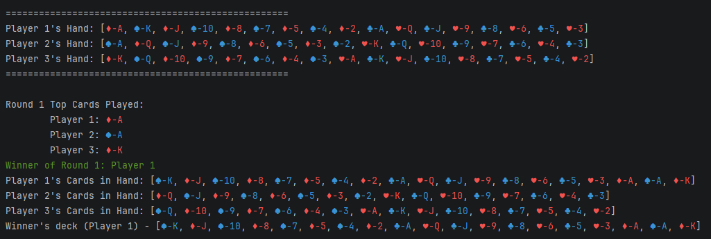
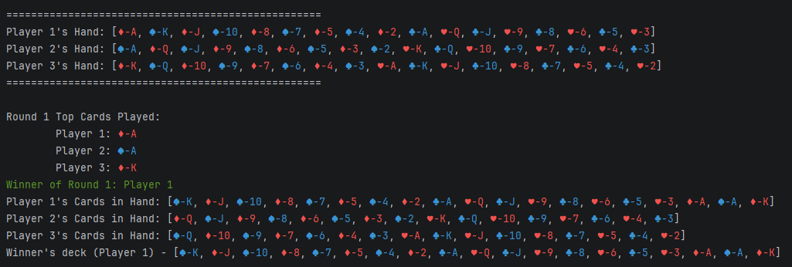
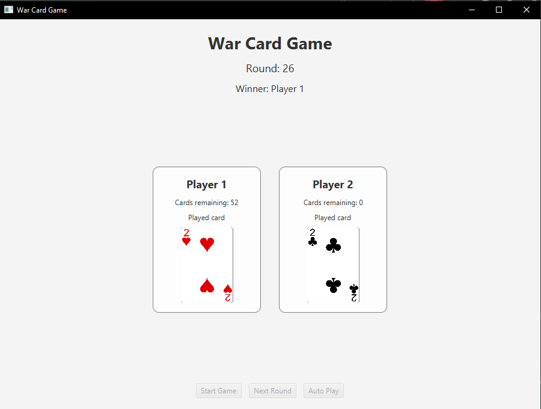

# CardGames

CardGames is a Java 25 project containing terminal-based implementations of **War** and an automatic **Klondike Solitaire** solver. Both games share reusable models for cards, decks, players, input, and shuffling. An experimental JavaFX interface is also available for War.

## Current status

| Area | Status | Progress |
| --- | --- | --- |
| Shared framework | Complete | Reusable card, deck, player, game, terminal color, file input, and shuffle components |
| War — console | Functional | Full multiplayer game loop, validated deck input, round logs, replay, and winner-deck output |
| Solitaire — console | Functional | Automatic move selection, win detection, and no-progress/cycle detection |
| War — JavaFX | In progress | Start, next-round, and auto-play controls with card images and player state |
| Solitaire — JavaFX | Planned | Menu entry exists, but the Solitaire button is not connected to a game view yet |
| Automated tests | Planned | No test suite has been added yet |

## Recent progress

Updates completed through **August 7, 2026**:

- Added an explicit Exit option and replay flow to the console menu.
- Added terminal colors for cards, winners, eliminations, and game results.
- Improved War round logs so played cards are identified by player.
- Added deck-file discovery and validation for file existence, card format, and the required 52-card count.
- Added automatic `.txt` extension handling for deck filenames.
- Added winner-deck export to `src/decks/output.txt`.
- Improved output deck formatting and game messages.
- Added a JavaFX War view with card artwork, manual rounds, and timed auto-play.
- Refactored variable names, removed unused methods, and cleaned up the codebase.

## Features

### Shared framework

- `Card`, `Deck`, `Player`, `Game`, `Suit`, and `Rank` abstractions
- File-based deck loading
- Perfect and random shuffle strategies
- ANSI-colored terminal output
- Shared card image resources for desktop views

### War

- Two to eight players
- Configurable perfect-shuffle count
- Even card distribution with excess-card handling
- Automatic round and winner resolution
- Per-round played-card, hand, and winner summaries
- Manual and automatic play in the JavaFX prototype
- Final winner deck saved to `src/decks/output.txt`

### Solitaire

- Seven tableau piles, four foundations, a talon, and a waste pile
- Ordered deal from a selected deck file
- Face-up and face-down card state
- Draw-three talon behavior and waste recycling
- Foundation and tableau move validation
- Movement of valid face-up tableau sequences
- Automatic left-to-right move search
- Win and no-progress detection
- Numbered move descriptions in the terminal

The solver uses this move priority:

1. Tableau to foundation
2. Tableau to tableau
3. Waste to foundation
4. Waste to tableau
5. Draw up to three cards from talon to waste
6. Recycle waste into the talon when progress was made
7. End when the foundations are complete or no further progress is possible

The solver is deterministic and does not guarantee an optimal solution.

## Current displays

### Main menu

```text
╔══════════════════════════════╗
║     HANNAH'S CARD GAMES      ║
╠══════════════════════════════╣
║  [1] War                     ║
║  [2] Solitaire               ║
║  [0] Exit                    ║
╚══════════════════════════════╝
Choose a game:
```

### War console



Card suits and important game messages are color-coded in terminals that support ANSI colors.

### Solitaire console



### War JavaFX

The JavaFX display shows the round number, game status, each player's remaining card count and played card, plus controls for the next round and auto-play.



## Requirements

- JDK 25
- IntelliJ IDEA (recommended)
- Maven 3.9+ for the JavaFX launcher

## Run the project

Open the repository in IntelliJ IDEA and configure the project SDK as JDK 25.

### Run the console application

1. Open `src/Main.java` in IntelliJ IDEA.
2. Press the green **Run/Play** button beside the `main` method.
3. Use IntelliJ's Run terminal to interact with the game.

Choose War, Solitaire, or Exit from the main menu. When prompted for a deck, enter a filename from `src/decks`; the `.txt` extension is optional. For example, entering `input` loads `src/decks/input.txt`.

### Run the JavaFX prototype

Run the following Maven goal from IntelliJ's terminal at the repository root:

```bash
mvn javafx:run
```

The JavaFX War screen is functional, but setup currently reads the deck filename, player count, and shuffle count from the terminal where Maven was launched. The Solitaire GUI is not implemented yet.

## Deck format

A deck file must contain exactly 52 comma-separated card codes. Each card uses `<suit>-<rank>`:

- Suits: `C`, `D`, `H`, `S`
- Ranks: `A`, `2`–`10`, `J`, `Q`, `K`

Example:

```text
Initial card sequence: D-A,D-K,D-Q,D-J,D-10,...,C-3,C-2
```

Sample and diagnostic decks are stored in `src/decks`.

## Project structure

```text
CardGames/
├── docs/                  # Screenshots and documentation assets
├── resources/             # Card-face and card-back images
├── src/
│   ├── core/              # Shared game models and terminal colors
│   ├── decks/             # Input, output, and sample deck files
│   ├── io/                # Console and file input
│   ├── shuffle/           # Shuffle strategies
│   ├── solitaire/         # Solitaire model and automatic solver
│   ├── ui/                # JavaFX application, views, and controllers
│   ├── wcg/               # War game, player, and round logic
│   └── Main.java          # Console entry point
└── pom.xml                # Java 25, JavaFX, and Maven configuration
```

## Roadmap

- [x] Complete console War gameplay
- [x] Complete the automatic console Solitaire flow
- [x] Add validation and winner-deck output
- [x] Add an initial JavaFX War interface
- [ ] Separate console input/output fully from game logic
- [ ] Complete the JavaFX setup flow without terminal prompts
- [ ] Implement the JavaFX Solitaire interface
- [ ] Add unit and integration tests
- [ ] Add JavaDoc for public APIs
- [ ] Expand the shared framework for more card games
- [ ] Build a Spring Boot API and web frontend

## Game specifications

- [War Card Game specification](https://svicomph-my.sharepoint.com/:w:/g/personal/mlactaoen_svi_com_ph/IQBkXYVl-FbeTpr3sXhMpyQiAUk1XL2-M5A6yQbAcExp-rs?e=XExCBf&wdExp=TEAMS-TREATMENT&web=1&TeamsCID=e7b0533d-9d15-4564-9710-349089f3b02a&linkOpenTime=1784247721133)
- [Solitaire specification](https://svicomph-my.sharepoint.com/:w:/g/personal/mlactaoen_svi_com_ph/IQAN3Ad6vJnOT6so96L3U0VnAUxRdRejPBWxOOkTjuBBIQ0?e=CJYwdm&wdExp=TEAMS-TREATMENT&web=1&TeamsCID=b7a17a71-dc57-4464-a776-1660e5508203&linkOpenTime=1784249595940)

Card artwork: [Playing Cards Vector PNG on OpenGameArt](https://opengameart.org/content/playing-cards-vector-png)
